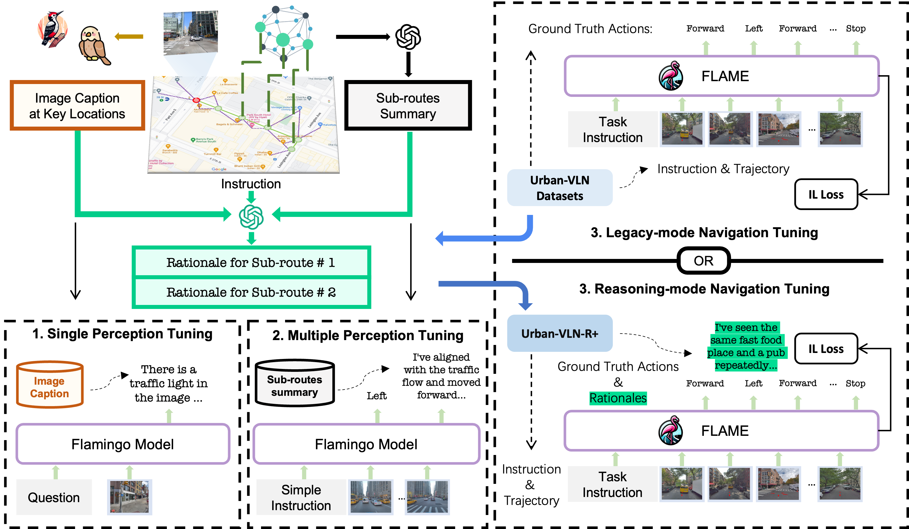

# 🦩 FLAME

[Visit project webpage (including DEMO)](https://PaperCodePreview.github.io)

Implementation of FLAME and Urban-VLN-R+ for the paper:

**FLAME: Navigating and Reasoning with Multimodal LLM in Urban Environments**  
Anonymous ECCV Submission

<p float="left">
  
</p>

This repository contains code for reproducing results.

## 📖 Table of Contents <!-- omit in toc -->
* [👋 Overview](#-overview)
* [🤖️ Method Details](#-method-details)
* [🗄 Urban-VLN-R+](#-urban-vln-r)
* [🛠️ Training and Evaluation](#-training-and-evaluation)
## 👋 Overview
> FLAME is an agent based on Multimodal Large Language Model, which can follow instruction and explain the rationale behind its decisions. In real-world tasks that involve interaction between humans and machines, it is crucial to develop such an agent that is both reliable and intention-aware.

> We also introduce Urban-VLN-R+, an extended dataset that emphasizes the training and evaluation of agents' reasoning process.

## 🤖 Method Details

<p float="left">
  
</p>

> Based on the Flamingo architecture, FLAME can navigate well in the urban environment. In reasoning mode, FLAME generates a rationale at key locations prior to decision-making, whereas in legacy mode, it proceeds directly to decisions. The agent operates autoregressively, enabling end-to-end tuning for optimal performance.

<p float="left">
  
</p>

> Our training procedure is three-phase. The first phase trains the model on single-perception tasks utilizing caption data. The second phase escalates to handling multi-perceptual input. Finally, the model undergoes an end-to-end fine-tuning to proficiently operate in both legacy and reasoning modes.

## 🗄 Urban-VLN-R+

<div align="center">
  
</div>

> This crafted dataset serves a dual purpose: it measures the agent’s performance not just in terms of navigational accuracy but also through the coherence and relevance of its generated rationales. This dual metric approach ensures the agent’s reasoning abilities are effective and applicable in real-world scenarios.


## 🛠️ Training and Evaluation
FLAME is trained based on Otter and OpenFlamingo. The training is based on Deepspeed.
(Some parts of the code will be released after acceptance.)

Training:

* `--legacy_navigation_mode`: Whether to use legacy navigation mode. If set to False, the model will generate rationales at key locations.
* `--task`: The task to train the model. It can be either `instruction_following` or `pretraining`.
* `--img_db`: The path to the image feature cache.
* `--dataset`: The path to the Urban-VLN-R+ dataset.
* `--train_if_data_path`: The path to the training data for instruction following.
* `--eval_if_data_path`: The path to the evaluation data for instruction following.
* `--train_pre_data_path`: The path to the training data for pretraining.
* `--eval_pre_data_path`: The path to the evaluation data for pretraining.
* `--env_batch_size`: The number of environments to run in parallel.

```bash
deepspeed train_flame_deepspeed.py \
--deepspeed ds_zero1_config.json \
--legacy_navigation_mode=False  \
--task=instruction_following \
--model_path=luodian/OTTER-LLaMA7B-INIT \
--img_db="path/to/feature_cache" \
--dataset="path/to/Urban-VLN-R+/split" \
--train_if_data_path="path/to/Urban-VLN-R+/split/train" \
--eval_if_data_path="path/to/Urban-VLN-R+/split/dev" \
--train_pre_data_path="path/to/Urban-VLN-R+/pre/train" \
--eval_pre_data_path="path/to/Urban-VLN-R+/pre/dev" \
--batch_size=64 \
--num_train_epochs=10 \
--micro_batch_size=1 \
--env_batch_size=1 \
--eval_data_size=-1 \
--lr_scheduler=cosine \
--learning_rate=1e-4 \
--warmup_steps_ratio=0.01 \
```

Evaluation:

* `--temperature`: The temperature for sampling rationales from the model.
* `--decoding_paths`: The number of paths to decode in self consistency.

```bash
python navigate.py \
pipeline/train/instruction_following.py \
--checkpoint_path='path/to/flame_ckpt'  \
--img_db="path/to/feature_cache" \
--dataset="path/to/Urban-VLN-R+/split" \
--eval_split=test \
--task=instruction_following \
--env_batch_size=1 \
--temperature=0.7 \
--decoding_paths=8 \
```
